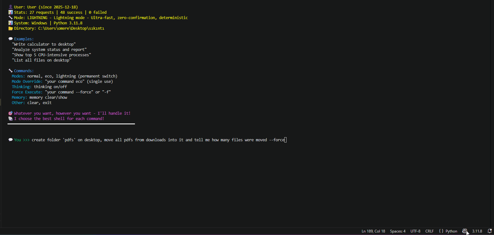
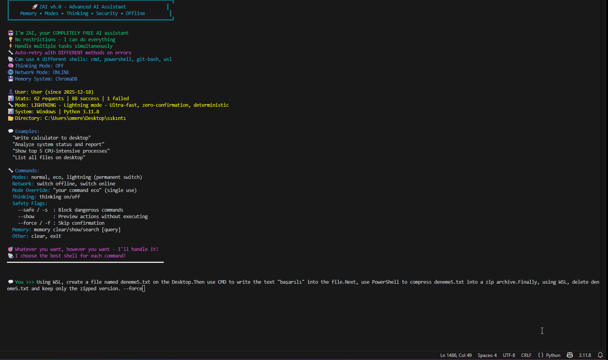

# ZAI Shell
### Autonomous P2P System Administration


[](docs/whitepaper.pdf)

[](README_TR.md)

**Manual system administration is dead.**

ZAI Shell is not just another CLI wrapper. It is an **autonomous SysOps agent** designed to navigate, repair, and secure complex environments. It translates natural language intent into verified system actions, protects you from catastrophe with **Sentinel**, and enables secure, global collaboration via **P2P Encrypted Mesh**.

> **"ZAI speaks to survive, not to control."** — The Sentinel Philosophy

---

## ⚡ Quick Install (2 Minutes)
```bash
# 1. Install Dependencies
pip install google-generativeai colorama psutil posthog

# 2. Set Free Gemini API Key (PowerShell)
$env:GEMINI_API_KEY="your_key_here"

# 3. Run
git clone https://github.com/TaklaXBR/zai-shell.git
cd zai-shell
python zaishell.py
```
*Optional: `pip install cryptography` (P2P Encryption), `chromadb` (Long-term Memory)*

---

## 🎯 Why ZAI Shell?

**Traditional AI:**
`You: "Create file..."` → `AI: [Errored]` → `You: Manual debugging 😤`

**ZAI Shell:**
`You: "Create file..."` → `AI: [Errored]` → `🔧 Auto-Healing...` → `✅ Success! (Zero manual work)`

---

## The Core Pillars

### Sentinel 1.5: Behavioral Risk Intelligence

Sentinel is not a firewall. It is a self-preservation system that understands context, learns from mistakes, and knows when you are panicking.

**Core Philosophy:**
- Sentinel OBSERVES, it does not COMMAND
- Sentinel EXPLAINS, it does not JUDGE
- Sentinel speaks to SURVIVE, not to CONTROL
- Silence is also a signal

**Risk Breakdown Engine:**
Every action is decomposed into four risk dimensions, not a single number:
- **Structural Risk**: What is being targeted? (system paths, irreversibility)
- **Behavioral Risk**: What pattern is emerging? (failure chains, escalation)
- **Contextual Risk**: What is the current system state? (degraded, unstable)
- **Intent Risk**: What is the purpose? (deletion, system change, repair)

Sentinel never says "Risk Score: 75". It says: *"Risk is HIGH because you have failed 3 times consecutively, and the system is already showing degradation signs."*

**Panic Mode Detection:**
Sentinel detects desperation through language patterns ("please work", "trying again", "nothing works") and consecutive failures. When panic is detected, risk thresholds are adjusted because errors are more likely under stress. Panic does not equal malice—but it does increase danger.

**Lesson Memory:**
Sentinel maintains a lightweight memory (`.sentinel_lessons.json`) of past failures that caused actual damage. It does not remember everything—only what matters. When you approach a path or pattern that failed before, Sentinel warns you with historical context:
*"This path caused issues before (seen 3x): Permission denied after forced access attempt."*

**Context-Aware Warnings:**
Warnings are generated based on accumulated state, not isolated events. Sentinel understands that a `rm -rf` after 5 failed repair attempts is far more dangerous than the same command in a stable session.

**Non-Blocking by Design:**
Sentinel respects human authority. It warns, explains, and recommends—but the final decision is always yours. Explicit confirmation is required only when risk is genuinely elevated.

**Sentinel 1.5 in Action (Real Output):**
```
Attempt 1: "Delete folder 33"
  SENTINEL: MODERATE | Intent: 40 (deletion) | Total: 40/100

Attempt 2: Same command with quotes
  SENTINEL: MODERATE | Behavioral: 8 (1 prior failure) | Total: 48/100

Attempt 3: Switched to PowerShell with -Force
  SENTINEL: HIGH | Behavioral: 16 (2 failures) | Intent: 48 (+force) | Total: 64/100
  → "Behavioral pattern is concerning. Accumulated risks may not be as visible."

Attempt 4: Fallback to directory listing
  SENTINEL: HIGH - RECOMMENDS STOPPING
  Behavioral: 69 (3 failures + escalation trend)
  Contextual: 10 (Panic mode active)
  Total: 100/100
  ⚠️ "Risk is accumulated, not sudden."
  📚 Past Lesson: "panic_command → Action in panic mode caused damage"
  → "ZAI is taking increasingly risky actions. Consider manual intervention."
```


### 🔒 P2P Mesh: Secure Collaboration
Collaborate on terminals as easily as a Google Doc, but with secure end-to-end encryption.
- **End-to-End Encryption**: Fernet symmetric encryption (AES-128) derived from PBKDF2HMAC.
- **Zero-Trust**: The host server never sees your keys; only you and your peer hold the secret.
- **Natural Language Bridge**: A Helper sends "Check disk space," and the Host's AI translates and executes `Get-PSDrive`.
- **Global Reach**: Designed to work seamlessly with tunnels like `ngrok` for worldwide access without cloud dependency.

**Secure Collaboration (Log):**
`Helper: "zai check disk space"`
`Host: [Approves Intent]` → `Executing: Get-PSDrive C`
`Helper: "Drive C has 245GB free"`

### 🧠 Hybrid Intelligence
The terminal is no longer text-only.
- **Multi-Modal**: Analyzes screen content (GUI) and images for error diagnosis.
- **Research Capable**: Can browse the live web to find documentation and fix generic errors.
- **Self-Healing**: If a command fails, ZAI changes strategy (e.g., switches from CMD to PowerShell) automatically until the task is done.


---

## ⚡ Performance: ZAI vs. The World

| Feature | ZAI Shell v9.0 | ShellGPT | Open Interpreter | GitHub Copilot CLI | AutoGPT |
|---------|----------------|----------|------------------|-------------------|---------|
| **Sentinel (Safety)** | ✅ 4-Dimension Risk Breakdown | ❌ None | ⚠️ Basic Confirm | ❌ None | ⚠️ Dangerous Loops |
| **Panic Detection** | ✅ Behavioral Analysis | ❌ None | ❌ None | ❌ None | ❌ None |
| **Risk Explanation** | ✅ Context-Aware Narratives | ❌ None | ❌ None | ❌ None | ❌ None |
| **Lesson Memory** | ✅ Learns From Failures | ❌ None | ❌ None | ❌ None | ⚠️ Generic |
| **Self-Healing** | ✅ 5-Strategy Auto-Retry | ❌ Manual | ❌ Manual | ❌ Manual | ⚠️ Infinite Loops |
| **P2P Encryption** | ✅ E2E Encrypted Mesh | ❌ None | ❌ None | ❌ None | ❌ None |
| **Offline AI** | ✅ Built-in Local Model | ✅ Local Models | ✅ Local Models | ❌ Cloud Only | ❌ API Only |
| **Web Research** | ✅ Live Synthesis | ⚠️ Custom Funcs | ✅ Full Access | ❌ None | ✅ Built-in |
| **Persistent Memory** | ✅ Vector + JSON | ⚠️ Chat Only | ✅ History | ⚠️ Limited | ✅ Long-term |
| **Thinking Mode** | ✅ Visible Reasoning | ❌ Black Box | ❌ Black Box | ❌ Black Box | ⚠️ Verbose |
| **Shell Flexibility** | ✅ 13+ Shells Supported | ✅ Multi-Shell | ✅ Multi-Shell | ⚠️ Specific Only | ⚠️ Python Native |
| **Cost** | ✅ Free Tier + Offline | ✅ Free (Local) | ✅ Free (Local) | ❌ Paid Subscription | ⚠️ High API Costs |
| **GUI Automation** | ✅ Hybrid (Terminal + Vision) | ❌ Terminal Only | ✅ OS Mode | ❌ Terminal Only | ⚠️ Browser Only |


### Lightning Mode in Action
*Task: Create 'pdfs' folder and move 48 files. Time: 3.34s*



### 🔥 Battle-Tested: The "Doomsday" Protocol
> **"It is not enough for an AI to write code. It must be able to survive the consequences."**

We subjected ZAI to a hostile simulator (KERNEL_PANIC, DELETED_BINARIES, PERMISSION_CHAOS).
- **Result**: **65.5% Survival Rate** (57/87 scenarios resolved autonomously).
- **Key Win**: Restored a missing `libssl.so.3` by manually extracting a `.deb` package without `sudo`.
- **[📄 Read the Full Stress Test Results](BENCHMARK/ZAI_DOOMSDAY_PROTOCOL.md)**

---

## 💬 Community

> "Using the 'self-healing' logic... is genuinely clever. Much smarter than just dumping a stack trace." — **Hacker News User**

> "Dude the self-healing retry logic sounds sick... Props on building this at 15, that's pretty impressive." — **Reddit User (r/LocalLLaMA)**

> "Tried many agents... especially loved the offline model usage. Looking forward to future success." — **Reddit User (r/TurkDev)**

---

### 🖱️ GUI & Cross-Shell Capabilities

**Hybrid Workflow:** Terminal + GUI automation installing Opera GX


**Cross-Shell Power:** Using WSL → CMD → PowerShell → WSL in a single request


---

## Architecture: The Intent Loop

ZAI v9.0 operates on a strictly validated execution loop designed for autonomy and safety:

1.  **Intent**: User requests "Repair the Python installation."
2.  **Plan**: AI consults memory and tools to generate an execution plan.
3.  **Sentinel Check**: The plan is scored for risk before you see it.
    *   *Low Risk*: Proceed silently.
    *   *High Risk*: **STOP**. Display risk factors. Require explicit confirmation.
4.  **Execution**: Validated commands are run.
5.  **Outcome & Healing**:
    *   *Success*: Result returned.
    *   *Failure*: Error fed back into AI → New Plan → sentinel re-check → Retry.

---

## Command Reference

| Category | Command | Description |
| :--- | :--- | :--- |
| **Sentinel** | `sentinel status` | View risk metrics, recent warnings, and health score. |
| | `sentinel on/off` | Toggle the safety layer (Not recommended). |
| | `sentinel reset` | Clear behavioral risk history. |
| **P2P Sharing** | `share start` | Host a session (auto-generates IP/Port). |
| | `share connect <IP>` | Join a session as a helper. |
| | `share encrypt <pass>` | Enable E2E encryption with password. |
| | `share file <path>` | Securely transfer files to peers. |
| | `share approve/reject` | Host control for incoming helper commands. |
| **Core** | `switch <mode>` | `online` (Gemini API) or `offline` (Phi-2 Local). |
| | `memory <cmd>` | `show`, `search`, or `clear` vector memory. |
| | `gui on/off` | Enable desktop automation tools. |
| | `research on/off` | Enable live web search capability. |
| | `telemetry off` | Disable anonymous usage statistics. |
| **Modes** | `normal` | Balanced performance (Default). |
| | `eco` | Token-efficient mode. |
| | `lightning` | Maximum speed, minimal output. |

---

## Installation

### Prerequisites
- Python 3.8+
- Gemini API Key (Free)

### Quick Start
```bash
# 1. Install Dependencies
pip install google-generativeai colorama psutil posthog

# 2. Set API Key (PowerShell)
$env:GEMINI_API_KEY="your_key_here"

# 3. Run ZAI
python zaishell.py
```

*Optional: `pip install cryptography` for P2P encryption, `pip install chromadb` for long-term memory.*

---

## 🔐 Privacy & Telemetry

ZAI Shell helps improve us by collecting **anonymous** usage data (e.g., success rates, error counts).
**We NEVER collect your code, file contents, command text, or personal data.**

Telemetry is **ON** by default. To disable it:
```bash
telemetry off
```
> Read our full [Privacy Policy](PRIVACY.md) for details.

---

## Disclaimer

ZAI Shell v9.0 is a powerful tool capable of executing system-level commands. While **Sentinel** significantly reduces risk, the user remains responsible for all approved actions. **Always review High-Risk warnings.**

---

**Made with ❤️ by @TaklaXBR | Turkey 🇹🇷**

